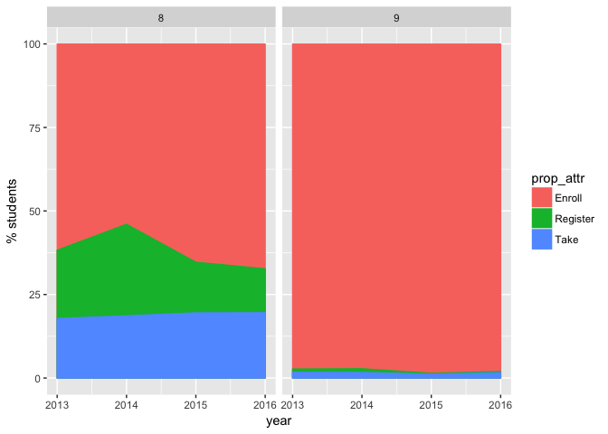
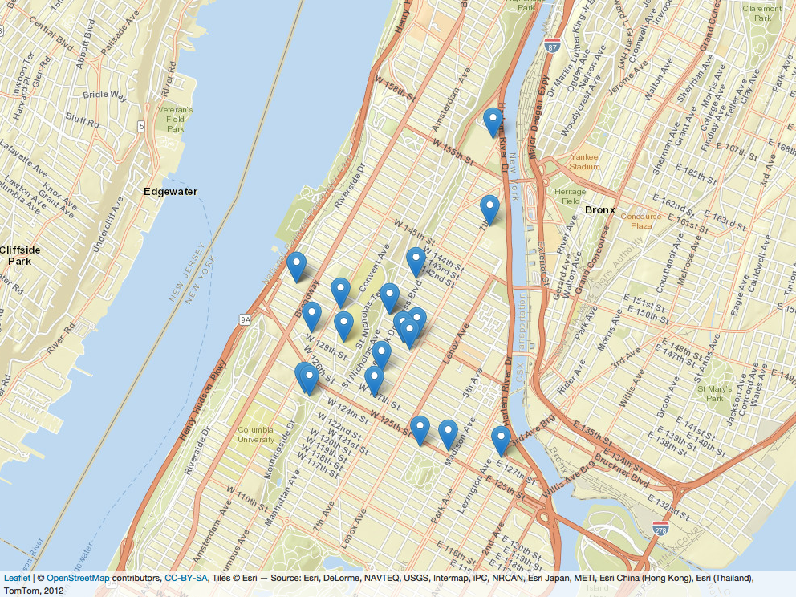
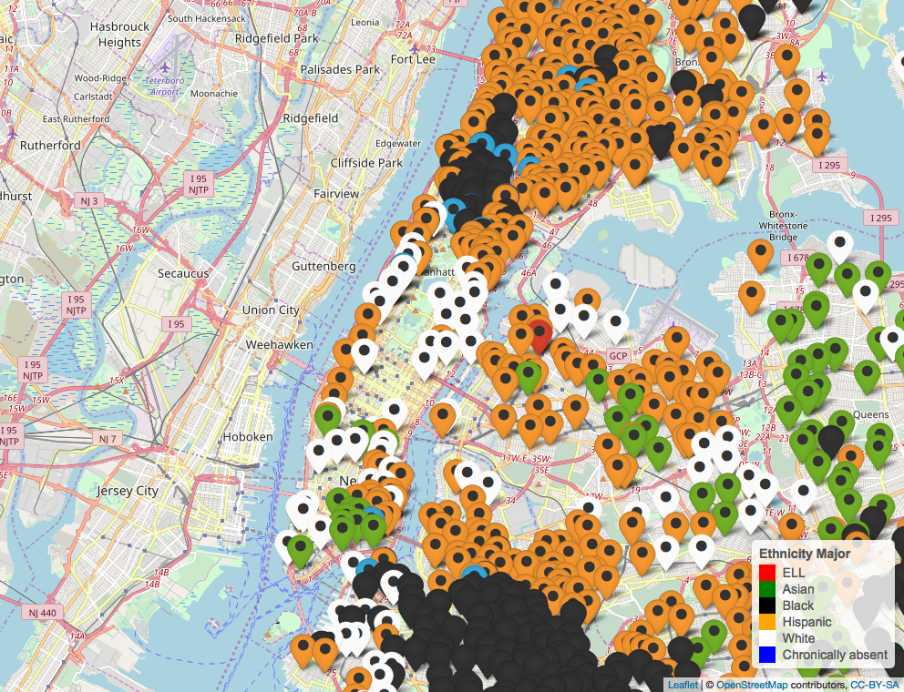
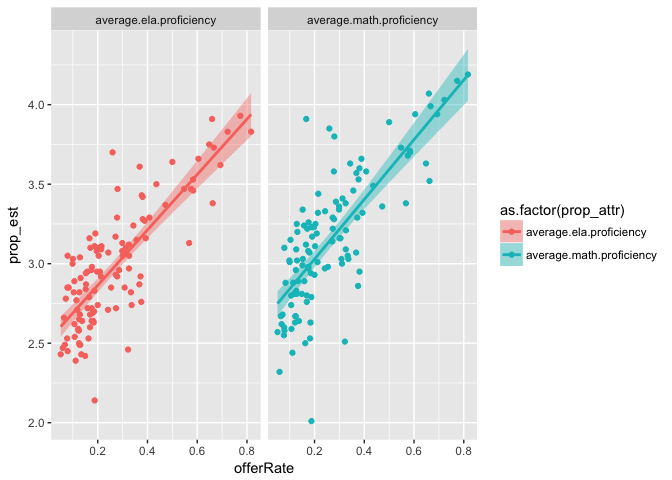
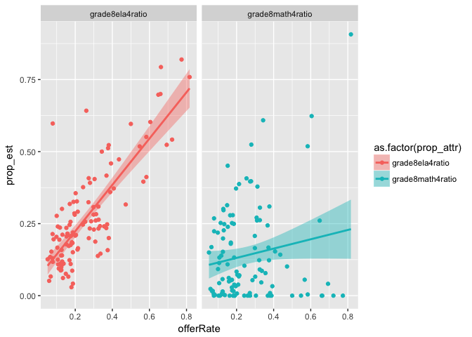
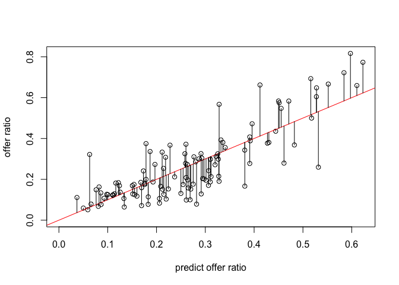
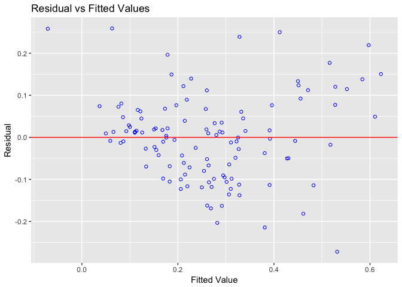
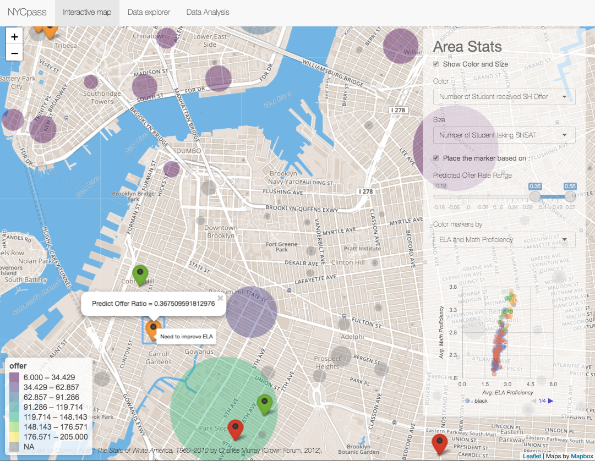

## Introduction 


This is a Kaggle challenge. Aiming to help an not-for-profit organization (PASSNYC) determine which schools need their services the most.

New York City is home to some of the most impressive educational institutions in the world, yet in recent years, the City’s specialized high schools - institutions with historically transformative impact on student outcomes - have seen a shift toward more homogeneous student body demographics.

How can we identify students within New York City’s under-performing school districts ? 
By focusing efforts in under-performing areas that are historically underrepresented in SHSAT registration, PASSNYC will help pave the path to specialized high schools for a more diverse group of students.

+ Download the csv files from [Kaggle](https://www.kaggle.com/passnyc/data-science-for-good/downloads/data-science-for-good.zip/3) 

## Objective

Identify the school/area of NYC needs PASSNYC's attention to improve the diverse group of students that attend the specialized high schools.


## Data 

- **D5 SHSAT Registrations and Testers.csv**


- **2016 School Explorer.csv**


## Data Visualization 

#### Overall trend of the SHSAT take ratio change between 2013 and 2016.

- Area plot: Schools Ratio distribution by year and grade

Conclusion?

+ Most of students enroll, register, and take their SHSAT at 8th grade. 
+ There are quite a lot of students enroll at 9th grade but few ends up register and take it. However, if 9th grade student registered , large porportion of registered students will end up take the exam. Students register and take the exam at 9th grade may aim for transferring to different schools.
+ At 2014, there are more students enroll and register SHSAT exam. However, the number of students take the SAT is pretty constant.
+ 8th grade SHSAT ratio should be representitive for the real situation.

+ In general, the SHSAT taken ratio is less than 25%. 
+ At year 2015 and 2016, the overall student SHSAT taken ratio after register is improving.

Potential problems: sample size is too small. 
+ This sheet only contain 28 schools information and look like upper Mahattan centered. 
+ `COLUMBIA SECONDARY SCHOOL` is the top school for SHSAT in terms of students enroll, register and take the exam. 

Is this data good enough to be the gold standard to use to find out what is the best indicators ?


<!-- -->

+ Where are those 28 schools ?


<div class="figure">

<p class="caption">School location of D5 SHSAT Registrations and Testers Datasheet</p>
</div>

#### After students enroll, register and take the exam, how many are they actually got the offer from any special high school? 
- From New York Times, there is an article that showing the offerred number information.
- The New York Times article can be viewed [**here**](https://www.nytimes.com/interactive/2018/06/29/nyregion/nyc-high-schools-middle-schools-shsat-students.html?rref=collection%2Fbyline%2Fjasmine-c.-lee&action=click&contentCollection=undefined&region=stream&module=stream_unit&version=latest&contentPlacement=1&pgtype=collection). 

Now, parse the htm(xml) and extract the table from the news.
I found:
+ There are 589 schools (dbn) in the website.
+ 537 schools have at least 1 student applied the SHSAT exam.
+ 120 of the 589 schools have at least 1 student got special high school offer after the SHSAT exam.


```
## [1] "Total # of schools in the xml =  589"
```

```
## [1] "# of schools at least 1 student took the SHSAT exam =  537"
```

```
## [1] "# of schools at least get 1 offer after taking the SHSAT exam =  120"
```

```
##     takeExam         offer            dbn           
##  Min.   :  6.0   Min.   :  6.00   Length:589        
##  1st Qu.: 15.0   1st Qu.:  9.00   Class :character  
##  Median : 26.0   Median : 19.50   Mode  :character  
##  Mean   : 47.2   Mean   : 33.42                     
##  3rd Qu.: 46.0   3rd Qu.: 46.00                     
##  Max.   :394.0   Max.   :205.00                     
##  NA's   :52      NA's   :469
```

+ `COLUMBIA SECONDARY SCHOOL` is the top school for SHSAT in terms of students enroll, register and take the exam among those 28 schools. Almost half of exam-taken students get the offer.   


```
## Joining, by = "dbn"
```

```
## # A tibble: 1 x 4
##   dbn    offer takeExam offerRate
##   <chr>  <int>    <int>     <dbl>
## 1 05M362    23       42     0.548
```

#### 2016 NYC public schools general information.
+ Dominate ethnicity of the students present in the schools and their geographical distribution.
+ This wasn't too surprising and basically similar with our understanding about the demographics of New York City. 


<div class="figure">

<p class="caption">NYC public school largest student ethnic group distribution</p>
</div>

* Find out what could be a good indicators to predict a school that are likely to got the offer from the NYC special high school offer rate after taking the SHSAT test.
  + **average.ela.proficiency**, **average.math.proficiency** are highly correlated with the **NYC special high school offer rate** as expected. The rest of the indicators do not seem to have strong contribution. 


<div class="figure">

<p class="caption">ELA and MATH average proficiency seems to be a strong indicators for entering the special high school </p>
</div>


<!-- --><!-- -->


#### Muli-linear regression model to predict received SH offer ratio.

- Create a SH offer rate predictor using average ELA and MATH proficiency.
  + Raw R-squared = 0.66, 10-fold cross validation R-squared = 0.63. The ELA and MATH proficiency explains ~65% variability of the response data.


```
## [1] "Raw R2 =  0.658231239342702"
```

```
## [1] "10 fold cross-validated R2 =  0.627812825536522"
```

<!-- -->
- To validate the model even further, we would like to test the residual normality.  
  + H₀: Data follow a normal distribution , H₁: Data do not follow a normal distribution.
  + Based on the tested result, p-value > 0.05 , accept H₀.
  + Residuals spread randomly around the 0:  indicating the relationship is linear and homogeneity.
  + No one residual is visibly away from the random pattern of the residuals indicating that there are no outliers. 
  + Therefore, the model should be able to use to make further prediction.


```
## [1] "Test Residual Normality"
```

```
## -----------------------------------------------
##        Test             Statistic       pvalue  
## -----------------------------------------------
## Shapiro-Wilk              0.9857         0.2482 
## Kolmogorov-Smirnov        0.0778         0.4722 
## Cramer-von Mises         31.9808         0.0000 
## Anderson-Darling          0.5568         0.1475 
## -----------------------------------------------
```

<!-- -->
## Extract columns for shiny visualization.

Here are columns that may be good to put in the shiny interactive display to do the further interactive visualization.
The field I have choosen are below:

- dbn = location.code  
- school.name
- latitude
- longitude 
- city
- zip
- district
- income
- average.ela.proficiency
- average.math.proficiency
- nytimes.takeExam
- nytimes.offer
- nytimes.offerRate
- SHofferRatePrediction.predictedOfferRatio  (Model Prediction results for the school didn't have offer # information.)
- Major ethic group
- Major ethic group proportion


#### [**Shiny App**](https://hueyling.shinyapps.io/help-PASSNYC/)
<div class="figure">

<p class="caption">Interactive shiny app to recommend school improvment.</p>
</div>

